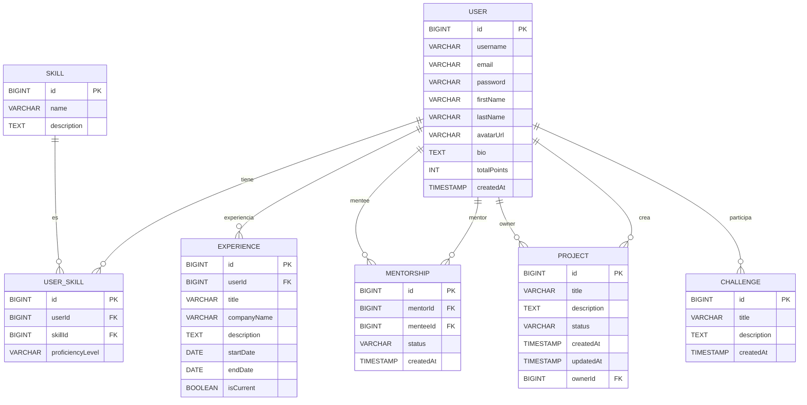

# 🚀 SkillLink

¡Bienvenido a **SkillLink**!  
La plataforma donde el talento se conecta, crece y colabora.  
Mentorías, proyectos, desafíos y mucho más para tu desarrollo profesional. 🌱✨

## 👩‍🏫 Aquí puedes:
- 💬 Participar en foros y ayudar a otros con tus ideas
- 🛠️ Crear y mostrar tus proyectos con orgullo
- 🧠 Ser mentor o mentora y guiar a nuevas mentes brillantes
- 📚 Diseñar y completar cursos que impulsan tu crecimiento
- 🏆 Superar desafíos y ganar experiencia (¡y puntos!)
- 🎖️ ¡Ganar badges por cada acción que enriquece a la comunidad!
- 🌍 En SkillLink, cada colaboración suma. Cada línea de código, cada palabra de aliento y cada proyecto compartido ayudan a construir un espacio donde todos brillan.

### 🧭 Nuestra brújula:
"Conectar talentos, encender ideas y crecer juntos."
🙌 ¿Listo para dejar huella en la comunidad? ¡Bienvenido a SkillLink!
---

## 📚 Tabla de Contenidos

- [🚀 SkillLink](#-skilllink)
  - [�‍🏫 Aquí puedes:](#-aquí-puedes)
    - [🧭 Nuestra brújula:](#-nuestra-brújula)
  - [🙌 ¿Listo para dejar huella en la comunidad? ¡Bienvenido a SkillLink!](#-listo-para-dejar-huella-en-la-comunidad-bienvenido-a-skilllink)
  - [📚 Tabla de Contenidos](#-tabla-de-contenidos)
  - [🌟 Descripción General](#-descripción-general)
  - [🗂️ Estructura del Proyecto](#️-estructura-del-proyecto)
  - [🔧 Requisitos Previos](#-requisitos-previos)
  - [📥 Clonado y Configuración](#-clonado-y-configuración)
    - [🔑 Variables de Entorno](#-variables-de-entorno)
  - [🛠️ Backend (Spring Boot)](#️-backend-spring-boot)
    - [⚡ Instalación y Ejecución](#-instalación-y-ejecución)
    - [📦 Estructura Clave](#-estructura-clave)
  - [💻 Frontend (React + Vite)](#-frontend-react--vite)
    - [⚡ Instalación y Ejecución](#-instalación-y-ejecución-1)
    - [📦 Estructura Clave](#-estructura-clave-1)
  - [📝 Licencia](#-licencia)
  - [🗺️ Diagrama ERD Interactivo](#️-diagrama-erd-interactivo)

---

## 🌟 Descripción General

SkillLink es una plataforma **fullstack** (Java Spring Boot + React + TypeScript) que te permite:

- 📝 Registrarte e iniciar sesión
- 🤝 Crear y explorar proyectos colaborativos
- 🧑‍🏫 Buscar y ofrecer mentorías
- 🏆 Participar en desafíos y foros
- 🧑‍💻 Gestionar tu perfil, habilidades y experiencias

¡Únete y potencia tu carrera junto a una comunidad vibrante! 🚀

---

## 🗂️ Estructura del Proyecto

```
SkillLink Project/
│
├── backend/
│   ├── backend/
│   │   ├── src/
│   │   │   ├── main/
│   │   │   │   ├── java/com/skilllink/backend/...
│   │   │   │   └── resources/
│   │   │   └── test/
│   │   ├── pom.xml
│   │   ├── mvnw, mvnw.cmd
│   │   └── .mvn/
│   └── ...
│
├── skilllink-frontend/
│   ├── src/
│   │   ├── components/
│   │   ├── pages/
│   │   ├── services/
│   │   ├── types/
│   │   └── ...
│   ├── public/
│   ├── package.json
│   ├── tsconfig.json
│   └── ...
│
└── README.md
```

---

## 🔧 Requisitos Previos

- **Node.js** >= 18.x
- **npm** >= 9.x
- **Java** >= 17
- **Maven** (wrapper incluido)
- **PostgreSQL** (o tu base de datos favorita)

---

## 📥 Clonado y Configuración

```bash
git clone https://github.com/Orliluq/skillLink.git
cd skillLink
```

### 🔑 Variables de Entorno

- Backend: configura `src/main/resources/application.properties`
- Frontend: crea `.env` si necesitas personalizar endpoints

---

## 🛠️ Backend (Spring Boot)

### ⚡ Instalación y Ejecución

```bash
cd backend/backend
./mvnw clean install
./mvnw spring-boot:run
```

- Accede a la API en: [http://localhost:8080](http://localhost:8080)

### 📦 Estructura Clave

- `controller/` — Controladores REST
- `service/` — Lógica de negocio
- `repository/` — Acceso a datos (JPA)
- `model/` — Entidades JPA
- `dto/` — Objetos de transferencia de datos

---

## 💻 Frontend (React + Vite)

### ⚡ Instalación y Ejecución

```bash
cd skilllink-frontend
npm install
npm run dev
```

- Accede a la app en: [http://localhost:5173](http://localhost:5173)

### 📦 Estructura Clave

- `components/` — Componentes reutilizables
- `pages/` — Vistas principales
- `services/` — Lógica de acceso a API
- `types/` — Tipos TypeScript compartidos

---

## 📝 Licencia

MIT License

```
MIT License

Copyright (c) 2024 Orli Dun

Permission is hereby granted, free of charge, to any person obtaining a copy
of this software and associated documentation files (the "Software"), to deal
in the Software without restriction, including without limitation the rights
to use, copy, modify, merge, publish, distribute, sublicense, and/or sell
copies of the Software, and to permit persons to whom the Software is
furnished to do so, subject to the following conditions:

The above copyright notice and this permission notice shall be included in all
copies or substantial portions of the Software.

THE SOFTWARE IS PROVIDED "AS IS", WITHOUT WARRANTY OF ANY KIND, EXPRESS OR
IMPLIED, INCLUDING BUT NOT LIMITED TO THE WARRANTIES OF MERCHANTABILITY,
FITNESS FOR A PARTICULAR PURPOSE AND NONINFRINGEMENT. IN NO EVENT SHALL THE
AUTHORS OR COPYRIGHT HOLDERS BE LIABLE FOR ANY CLAIM, DAMAGES OR OTHER
LIABILITY, WHETHER IN AN ACTION OF CONTRACT, TORT OR OTHERWISE, ARISING FROM,
OUT OF OR IN CONNECTION WITH THE SOFTWARE OR THE USE OR OTHER DEALINGS IN THE
SOFTWARE.
```

---

## 🗺️ Diagrama ERD Interactivo

> **Tip:** ¡Copia este bloque y pégalo en [https://mermaid.live/](https://mermaid.live/) para verlo y editarlo!  
> Si usas [dbdiagram.io](https://dbdiagram.io), puedes convertirlo fácilmente.



---

> ¿Dudas, sugerencias o quieres contribuir?  
> ¡Abre un issue, un pull request o escríbenos!  
> ¡Gracias por ser parte de la comunidad SkillLink! 💙🚀
