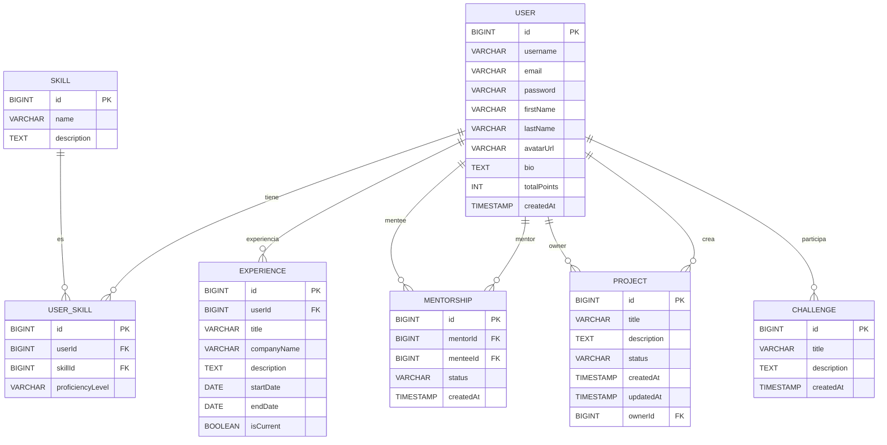

# SkillLink

SkillLink es una plataforma web para conectar profesionales y estudiantes, facilitando mentorías, colaboración en proyectos y desarrollo de habilidades.

---

## Tabla de Contenidos

- [SkillLink](#skilllink)
  - [Tabla de Contenidos](#tabla-de-contenidos)
  - [Descripción General](#descripción-general)
  - [Estructura del Proyecto](#estructura-del-proyecto)
  - [Requisitos Previos](#requisitos-previos)
  - [Clonado y Configuración](#clonado-y-configuración)
    - [Variables de Entorno](#variables-de-entorno)
  - [Backend (Spring Boot)](#backend-spring-boot)
    - [Instalación y Ejecución](#instalación-y-ejecución)
    - [Estructura Clave](#estructura-clave)
  - [Frontend (React + Vite)](#frontend-react--vite)
    - [Instalación y Ejecución](#instalación-y-ejecución-1)
    - [Estructura Clave](#estructura-clave-1)
  - [Licencia](#licencia)
  - [🗺️ Diagrama ERD Interactivo](#️-diagrama-erd-interactivo)

---

## Descripción General

SkillLink es una plataforma fullstack compuesta por un backend en Java Spring Boot y un frontend en React + TypeScript (Vite). Permite a los usuarios:

- Registrarse e iniciar sesión
- Crear y explorar proyectos colaborativos
- Buscar y ofrecer mentorías
- Participar en desafíos y foros
- Gestionar perfiles, habilidades y experiencias

---

## Estructura del Proyecto

```
SkillLink Project/
│
├── backend/
│   ├── backend/
│   │   ├── src/
│   │   │   ├── main/
│   │   │   │   ├── java/com/skilllink/backend/...
│   │   │   │   └── resources/
│   │   │   └── test/
│   │   ├── pom.xml
│   │   ├── mvnw, mvnw.cmd
│   │   └── .mvn/
│   └── ...
│
├── skilllink-frontend/
│   ├── src/
│   │   ├── components/
│   │   ├── pages/
│   │   ├── services/
│   │   ├── types/
│   │   └── ...
│   ├── public/
│   ├── package.json
│   ├── tsconfig.json
│   └── ...
│
└── README.md
```

---

## Requisitos Previos

- **Node.js** >= 18.x
- **npm** >= 9.x
- **Java** >= 17
- **Maven** (wrapper incluido)
- **PostgreSQL** (o tu base de datos configurada)

---

## Clonado y Configuración

```bash
git clone https://github.com/Orliluq/skillLink.git
cd skillLink
```

### Variables de Entorno

Configura tus variables de entorno para backend y frontend según corresponda (por ejemplo, `.env` para frontend, `application.properties` para backend).

---

## Backend (Spring Boot)

### Instalación y Ejecución

```bash
cd backend/backend
./mvnw clean install
./mvnw spring-boot:run
```

- El backend corre por defecto en `http://localhost:8080`
- Configura tu base de datos en `src/main/resources/application.properties`

### Estructura Clave

- `controller/` — Controladores REST
- `service/` — Lógica de negocio
- `repository/` — Acceso a datos (JPA)
- `model/` — Entidades JPA
- `dto/` — Objetos de transferencia de datos

---

## Frontend (React + Vite)

### Instalación y Ejecución

```bash
cd skilllink-frontend
npm install
npm run dev
```

- El frontend corre por defecto en `http://localhost:5173`
- Configura endpoints en `src/services/api.ts` si es necesario

### Estructura Clave

- `components/` — Componentes reutilizables
- `pages/` — Vistas principales
- `services/` — Lógica de acceso a API
- `types/` — Tipos TypeScript compartidos

---

## Licencia

MIT License

## 🗺️ Diagrama ERD Interactivo

> **Tip:** ¡Copia este bloque y pégalo en [https://mermaid.live/](https://mermaid.live/) para verlo y editarlo!  
> Si usas [dbdiagram.io](https://dbdiagram.io), puedes convertirlo fácilmente.



Puedes copiar este bloque y pegarlo en [https://mermaid.live/](https://mermaid.live/) o [dbdiagram.io](https://dbdiagram.io) para interactuar y modificar el diagrama.

---